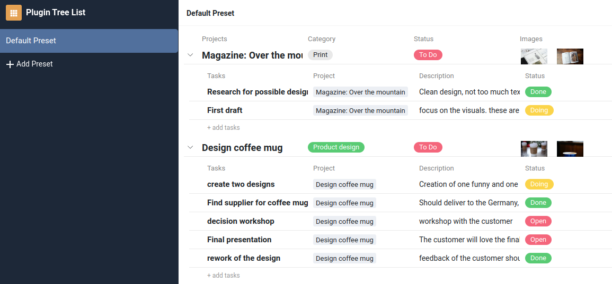

# SeaTable Tree Plugin

The tree plugin makes it easy to create, edit, and manage hierarchical data — whether it's projects and tasks, campaigns and deliverables, or a product roadmap and features — all within SeaTable.

The tree plugin enables the display of up to three linked tables in a hierarchical tree structure. Simply select the tables that are connected through linked columns, and you'll get a foldable/unfoldable hierarchy. This tree structure provides a significant advantage over the standard row details view, as it allows you to instantly see rows from all hierarchy levels that are interconnected.

## What is a SeaTable Plugin?

SeaTable, the world-leading no-code app-building platform, supports plugins. Plugins provide additional visualization or interaction possibilities within a SeaTable base. Examples of SeaTable Plugins include the Gallery, the Map Plugin, or the Kanban board. You can find a list of all publicly available plugins [here](https://cloud.seatable.io/apps/custom/plugin-archive).

## How to install

In general, a Plugin needs to be installed by the system admin on the SeaTable server and can then be activated in any base by the user. More information about the installation of plugins can be found in the [SeaTable Admin Manual](https://admin.seatable.io/configuration/plugins/?h=plugins).

## How to develop and contribute to this plugin

Please refer to the [SeaTable Plugin Template](https://github.com/seatable/seatable-plugin-template-base/tree/TB-staging) documentation on GitHub. This guide explains how to set up your local testing environment, create a `setting.local.js` file to connect to a SeaTable base, and more.

## Changelog

### Version 1.0.0

- Initial release with SeaTable v5.1
- Select up to three tables
- View selection for level 1
- Sorting option for level 2 and 3
- Resizing column width for all three levels
